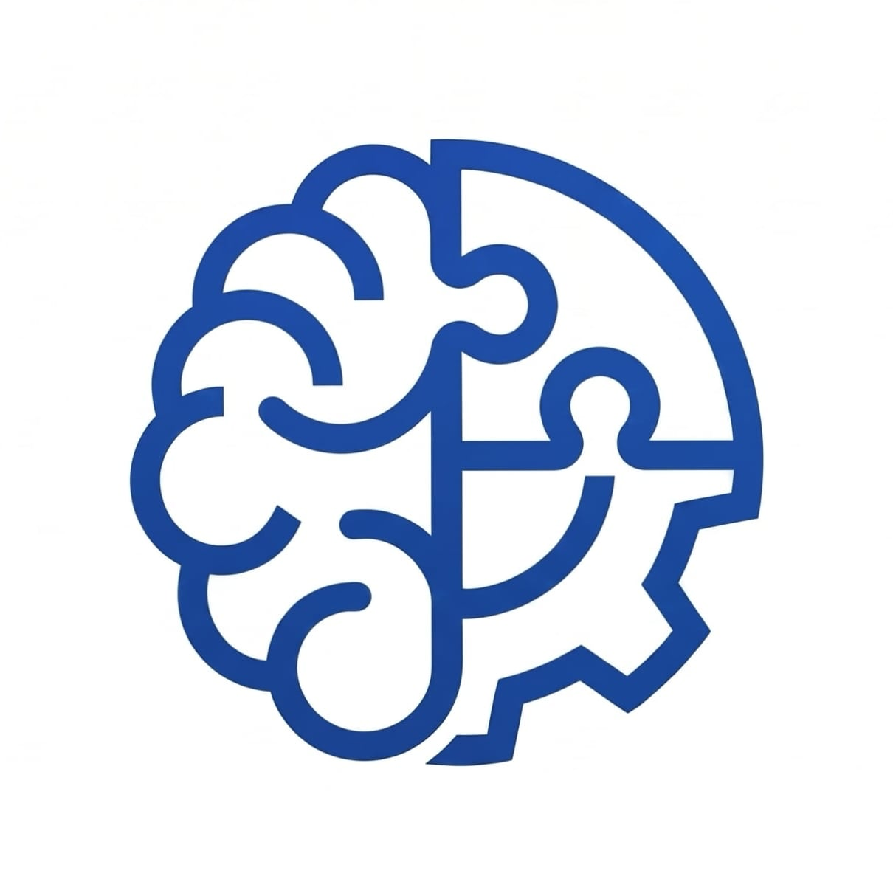

English | [简体中文](README.zh-CN.md)

<div align="center">



# Skills Hub

A native macOS app for collecting, previewing, updating, and sharing AI agent skills across Codex, Claude Code, Cursor, GitHub Copilot, and custom agents.

</div>

---

## Requirements

- macOS 15 or later
- Git, if you want to import or update skills from remote repositories

## Quick Start

1. Open Skills Hub.
2. Click `+` to add skills.
3. Import a local skill folder or discover skills from a Git repository.
4. Enable the agents you use in `Settings` -> `Agents`.
5. Click `Sync` to link your skills into the enabled agent skill folders.

## Import Skills

### From a Git Repository

1. Click `+`.
2. Choose `From Git URL`.
3. Paste a repository URL.
4. Click `Discover`.
5. Select the skills you want.
6. Click `Import Selected`.

Supported URL examples:

```text
owner/repo
github.com/owner/repo
github.com/owner/repo/tree/main/path/to/skills
gitlab.com/owner/repo/-/tree/main/path/to/skills
bitbucket.org/owner/repo/src/main/path/to/skills
git@github.com:owner/repo.git
```

### From a Local Folder

1. Click `+`.
2. Choose `Local Directory`.
3. Select a folder that contains `SKILL.md`.

Skills Hub copies the full skill folder into its managed skills directory.

## Use Skills With Agents

Open `Settings` -> `Agents` and enable the preset agents you use:

| Agent | Linked skill folder |
| --- | --- |
| Codex | `~/.codex/skills` |
| Claude Code | `~/.claude/skills` |
| Cursor | `~/.cursor/skills` |
| GitHub Copilot | `~/.copilot/skills` |

You can also add a custom agent by choosing a display name and the agent's skills directory.

When an agent is enabled, Skills Hub links imported skills into that agent's folder. Use `Sync` if links need to be created or repaired.

## Manage Skills

- Search skills from the sidebar.
- Select a skill to preview its rendered `SKILL.md`.
- Switch to source view when you want to inspect the raw Markdown.
- Click `Copy SKILL.md` to copy the skill prompt content.
- Click `Copy to Project` to export a skill into another project folder.
- Click `Reveal in Finder` to open the skill folder.
- Use `Update` to refresh skills that were imported from Git repositories.
- Use `Edit` to select and delete multiple skills.

## Skill Folder Format

Each skill must be a folder containing a `SKILL.md` file:

```text
my-skill/
  SKILL.md
  references/
  scripts/
  assets/
```

Only `SKILL.md` is required. Extra folders are kept with the skill and can be reused by agents that understand them.

## Build Locally

Run the app:

```sh
make run
```

Build the app bundle:

```sh
make app
```

Install the built app into `/Applications`:

```sh
make install
```

## Star History

[](https://starchart.cc/QuentinHsu/skills-hub)

## License

[MIT](LICENSE)
